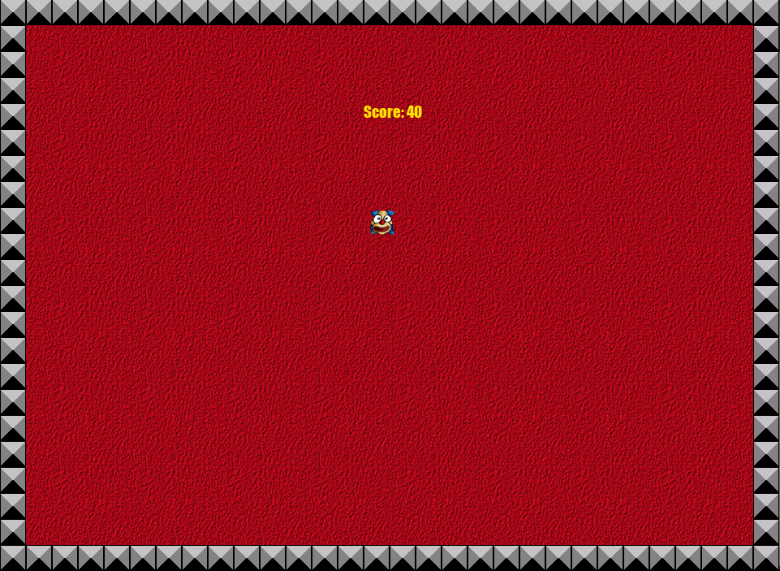

# Catch-the-Clown
First GameMaker Studio 2 project for my CIT160 course (Game and Simulation Programming)

## Summary
During this game, a clown moves around in a playing field. The goal of the player is to catch the clown by clicking on the clown with the left mouse button. As the player progresses through the game, the clown starts moving faster and it becomes more difficult to catch it. For each catch the score is raised.

## Goal
Get the highest possible score

